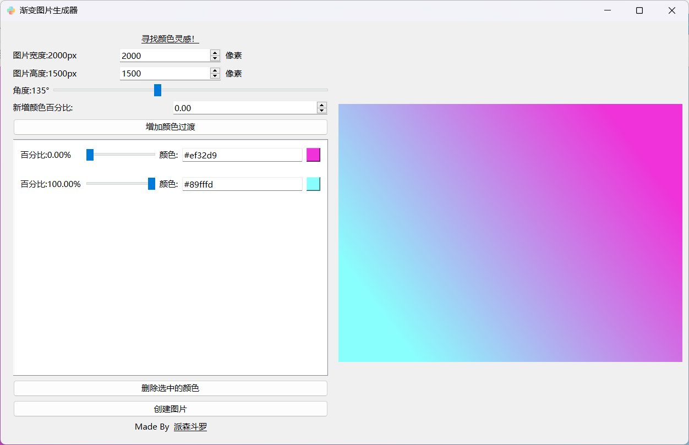
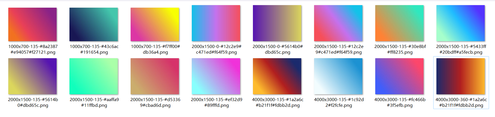

# GradientGen 渐变图片生成器
> GradientGen 是一款基于 PyQt6 的渐变图片生成器，它允许用户自定义图像的宽度、高度以及径向渐变的角度。
>
> 此外，用户还可以添加多个颜色节点，以创建更加丰富多彩的渐变效果。

仓库地址：[https://github.com/w-x-x-w/PyQt6_Apps](https://github.com/w-x-x-w/PyQt6_Apps)

## 特色功能
定制宽度和高度： 通过简单的界面设置，轻松调整生成图像的宽度和高度。

灵活的渐变角度： 选择径向渐变的角度，让图像呈现出不同的视觉效果。

多颜色节点支持： 新增多个颜色节点，精细调整渐变中每个颜色的位置和强度。

## 预览

### UI布局：

### 生成图片示例

## 如何使用
- 安装依赖： 在运行项目之前，请确保已安装 PyQt6。可以使用以下命令安装：`pip install PyQt6`
- 运行项目： 打开终端，导航到项目文件夹，运行以下命令：`python main.py`
- 定制渐变： 在应用界面中调整宽度、高度、渐变角度，并添加颜色节点，然后点击生成按钮。
- 保存图像： 生成的渐变图片将显示在应用界面上，您可以选择保存到本地。