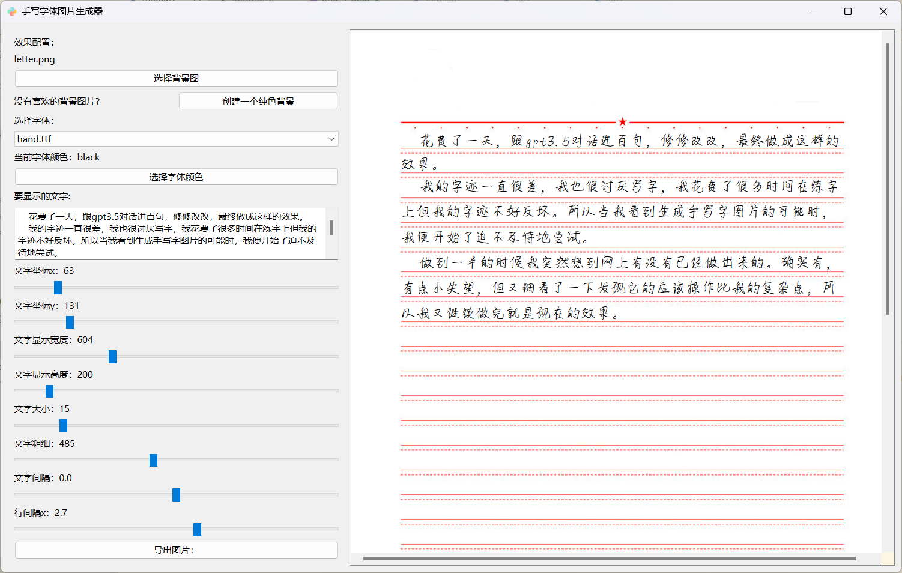
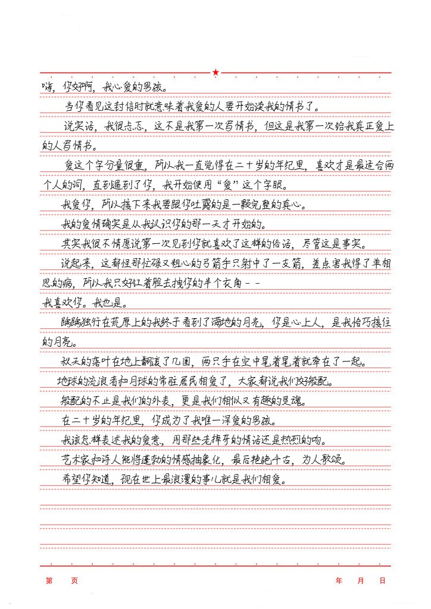

# [手写字体图片生成器](https://github.com/w-x-x-w/HandwritingGenerator)

## 介绍

> HandwritingGenerator 是一个使用 PyQt6 制作的手写文本图片生成器。
>
> 该工具允许用户自定义多种效果，通过在左边配置效果参数，右边实时预览，并在调整好后输出图片。

- **实时预览:** 在左侧配置效果参数时，右侧实时显示生成的手写文本图片，方便用户调整和查看效果。

- **自定义效果:** 用户可以根据需要调整多种效果参数，以生成符合个人喜好或特定场景需求的手写文本图片。

- **方便易用:** 使用直观的界面设计，使用户能够轻松上手，只需通过拖动滑块即可快速调整生成手写文本图片的效果。

- **多样化背景:** 提供常见图片的同时，用户可以选择生成各种尺寸纯色背景，以满足不同设计和应用场景的需求。

## 预览

**软件界面：**

**效果图：**

