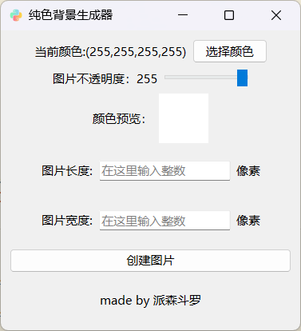
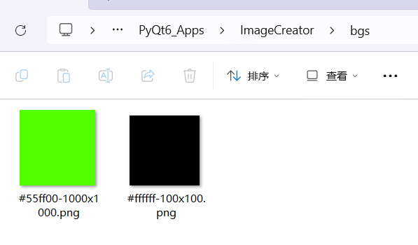

# 纯色图片生成器

这是一款使用PyQt6制作的纯色图片生成器，允许用户设置图片的宽度、高度和颜色透明度。

## 功能特点

- 生成纯色图片
- 自定义图片宽度和高度
- 调整颜色透明度

## 预览

### 界面预览：

### 效果预览

## 如何使用

1. 命令行安装所需依赖：`pip install PyQt6`
2. 克隆或下载本仓库到本地计算机。
3. 进入项目文件夹。
4. 在命令行中运行以下命令启动应用程序：`python ImageCreator.py`
5. 在应用程序中设置图片宽度、高度和颜色透明度。
6. 单击“生成图片”按钮生成纯色图片。

## 注意事项

- 本程序仅用于生成纯色图片，不支持复杂图案和图像编辑功能。

## 赞助选项

B站派森斗罗，充电支持
