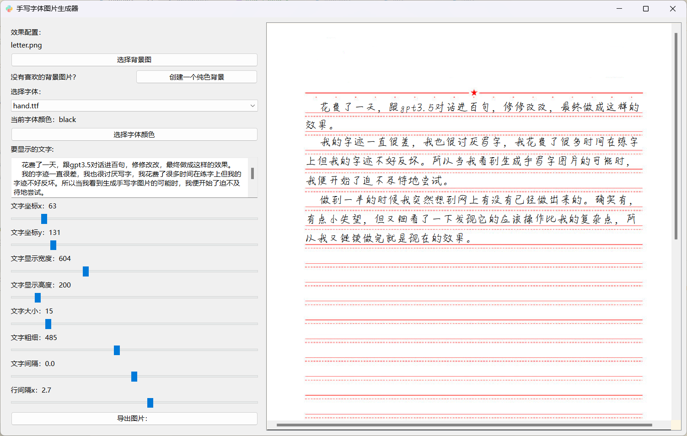
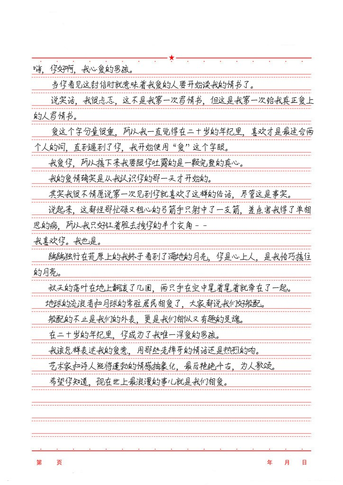

# PyQt6 小软件集合
> 这个仓库包含了使用 PyQt6 开发的多个小软件。每个软件都位于仓库的不同目录中。
>
> This repository contains several small applications developed using PyQt6. Each software is located in a different directory within the repository.

## 项目列表 

### [手写字体图片生成器](https://github.com/w-x-x-w/HandwritingGenerator)

#### 介绍

> HandwritingGenerator 是一个使用 PyQt6 制作的手写文本图片生成器。
>
> 该工具允许用户自定义多种效果，通过在左边配置效果参数，右边实时预览，并在调整好后输出图片。

- **实时预览:** 在左侧配置效果参数时，右侧实时显示生成的手写文本图片，方便用户调整和查看效果。

- **自定义效果:** 用户可以根据需要调整多种效果参数，以生成符合个人喜好或特定场景需求的手写文本图片。

- **方便易用:** 使用直观的界面设计，使用户能够轻松上手，只需通过拖动滑块即可快速调整生成手写文本图片的效果。

- **多样化背景:** 提供常见图片的同时，用户可以选择生成各种尺寸纯色背景，以满足不同设计和应用场景的需求。

#### 预览

**软件界面：**

**效果图：**

### [计算器](./Calculator)【未完成】

#### 预览

#### 介绍

- 基本的四则运算功能。 

- 用户友好的图形用户界面。 

### [任务清单应用](./TodoApp)【未完成】

#### 预览

#### 介绍

- 添加、编辑和删除任务。 

- 将任务标记为已完成。 

### [图片浏览器](./ImageViewer)【未完成】

#### 预览

#### 介绍

- 查看不同格式的图片。 
- 缩放和平移功能。 
## 使用 
1. 克隆仓库：
`git clone https://github.com/yourusername/PyQt6_Apps.git`
2. 安装 PyQt6：
`pip install PyQt6` 

每个小软件都有独立的目录，你可以进入每个目录查看详细的说明和使用说明。 欢迎贡献和提供建议！